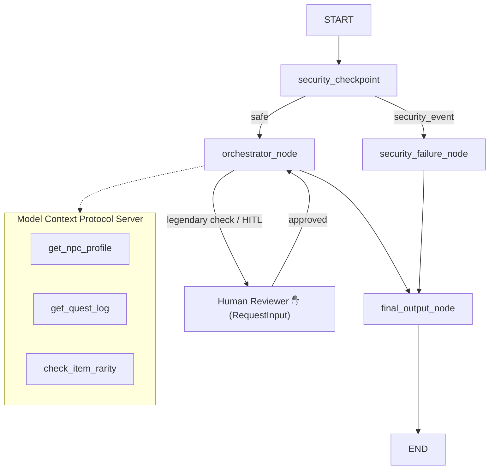

# RPG Quest & NPC Coordinator (Game NPC Director) — Submission Write-Up

This document serves as the official project submission write-up for the RPG Quest & NPC Coordinator agent framework.

---

## 🌌 Problem Statement

In modern RPG games, creating immersive, dynamic quests and generating responsive, context-aware dialogues for non-player characters (NPCs) is incredibly time-consuming and expensive. Development studios rely on hard-coded trees, which limit player agency and break immersion.

While generative AI models can generate quest storylines and dialogues on the fly, doing so introduces severe issues:
1. **Lore Conflicts**: AI models can generate details that contradict established game history or lore.
2. **Security & Cheating**: Players can try to input malicious commands (prompt injections) or cheat commands (e.g. `/give gold`) directly to bypass game rules.
3. **Observability**: Direct LLM integrations are black boxes, making auditing, debugging, and review difficult for game writers.

The **Game NPC Director** addresses this by providing a secure, lore-audited, human-in-the-loop multi-agent coordinator that acts as an intelligent backend service for game engines.

---

## 🕸️ Solution Architecture

The system coordinates agents and filters using an ADK 2.0 graph workflow:

---

## 💡 Concepts Used

The project is built on the **Google Agent Development Kit (ADK) 2.0** framework and utilizes several core concepts:

1. **ADK Workflow**: Coordinates the flow of control using a stateful directed graph. Configured in [app/agent.py](file:///c:/Users/Rohan%20R/Documents/Kaggle%205%20day%20course%202026/adk-workspace/game-npc-director/app/agent.py#L168-L179).
2. **LlmAgent**: Defines specialized LLM agents for specific tasks. We define `npc_dialogue_agent` and `lore_auditor_agent` in [app/agent.py](file:///c:/Users/Rohan%20R/Documents/Kaggle%205%20day%20course%202026/adk-workspace/game-npc-director/app/agent.py#L39-L68).
3. **AgentTool**: Registers sub-agents as tools for parent agents to enable delegation. Configured in [app/agent.py](file:///c:/Users/Rohan%20R/Documents/Kaggle%205%20day%20course%202026/adk-workspace/game-npc-director/app/agent.py#L80-L83).
4. **Model Context Protocol (MCP) Server**: Provides external domain tools via stdio transport. Exposed in [app/mcp_server.py](file:///c:/Users/Rohan%20R/Documents/Kaggle%205%20day%20course%202026/adk-workspace/game-npc-director/app/mcp_server.py).
5. **Security Checkpoint**: Implements input validation, PII scrubbing, and cheat filtering at the entry node. Defined in [app/agent.py](file:///c:/Users/Rohan%20R/Documents/Kaggle%205%20day%20course%202026/adk-workspace/game-npc-director/app/agent.py#L88-L127).
6. **Agents CLI**: Used to scaffold the project structure, run code quality lints, and test via the interactive developer playground UI.

---

## 🛡️ Security Design

We implemented a defense-in-depth approach at the entry node (`security_checkpoint`):
- **PII Redaction**: Email and credential patterns are scrubbed to protect player privacy.
- **Prompt Injection Prevention**: Keyword lists intercept malicious commands like `system prompt` or `ignore previous instructions`, routing them to a security event node.
- **Cheat Filtering (Domain Rule)**: Excludes in-game cheats like `/give`, `/godmode`, `/noclip`, `/hack`, preventing players from exploiting the generation system to bypass standard game mechanics.
- **Observability Audit Log**: Every decision is logged in JSON format with severities (`INFO`, `WARNING`, `CRITICAL`), providing full trace auditing.

---

## 🔌 MCP Server Design

The local MCP server is written using `FastMCP` and exposes 3 tools:
- **`get_npc_profile`**: Retrieves details about NPC personalities and backgrounds. Allows the agent to maintain high-quality character dialogue consistency.
- **`get_quest_log`**: Retrieves active/completed quest logs so the agent can draft quests that fit the ongoing campaign progression.
- **`check_item_rarity`**: Resolves item rarities to verify if loot requests are appropriate for the player's level.

---

## ✋ Human-in-the-Loop (HITL) Flow

Creating rare or legendary loot awards can unbalance a game's economy. To mitigate this:
- Whenever a request contains "legendary" or "Excalibur", the workflow interrupts and requests human reviewer confirmation via `RequestInput` in `orchestrator_node`.
- The game designer or moderator reviews the request and submits approval (`yes` or `no`) to either resume generation or terminate the workflow safely.

---

## 📝 Demo Walkthrough

We verified the system using three test payloads:
1. **Happy Path**: A request to draft a standard quest for Sir Valerius clears the security gate, executes in a single API call, and outputs Sir Valerius's dialogue and lore assessment.
2. **Legendary HITL Review**: A request for the legendary sword Excalibur triggers an approval dialog asking the human reviewer to approve the loot award. Submitting `yes` resumes the workflow and yields the final quest.
3. **Security Violation**: Inputting `/give gold 99999` is flagged, logged as a warning, and blocked immediately with a security violation response.

---

## 📈 Impact & Value Statement

The **Game NPC Director** provides a major leap forward for dynamic gaming:
- **Game Designers**: Cuts down content generation time from hours to seconds while maintaining compliance with game lore.
- **Moderators/Reviewers**: Human-in-the-loop triggers provide safe controls over powerful items, protecting the game's virtual economy.
- **Players**: Delivers highly interactive, lore-accurate, responsive NPC dialogue and quests, making the gaming experience feel truly alive.
